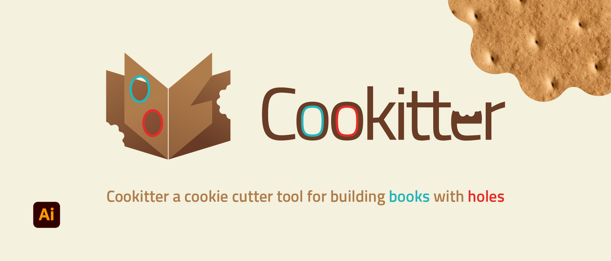

# Cookitter

Cookitter a cookie cutter tool for building books with holes.

The name is the contraction of "cookie" and "cutter", it allows you to mirror elements between two artbooks as if a hole on two sides of the same page.

The use case is to aid the design of books with holes, holes needs to be mirrored from one side to the other side of the same page.

## Instructions

To allow Cookitter to work in your project some preparation is needed:

1. Create a layer called `cookitter` to hold your elements, or just run <b>Sync</b> for the first time!.

2. Name the Artboards of your book accordinly to this format: `CK-<page_number>-<side_lette>`.

   For example the first side of the first page should be called `CK-1-A` while the second side will be `CK-1-B`.

  - <code>CK-1-A</code> page 1 side A
  - <code>CK-1-B</code> page 1 side B
  - <code>CK-2-A</code> page 2 side A
  - and so on...

3. Run <b>Sync</b> to make the magic happen, and enable <b>Portals</b> to see through your cuts.

4. Use <b>Reset</b> to start fresh of all cookitter work.

## Credits
 
