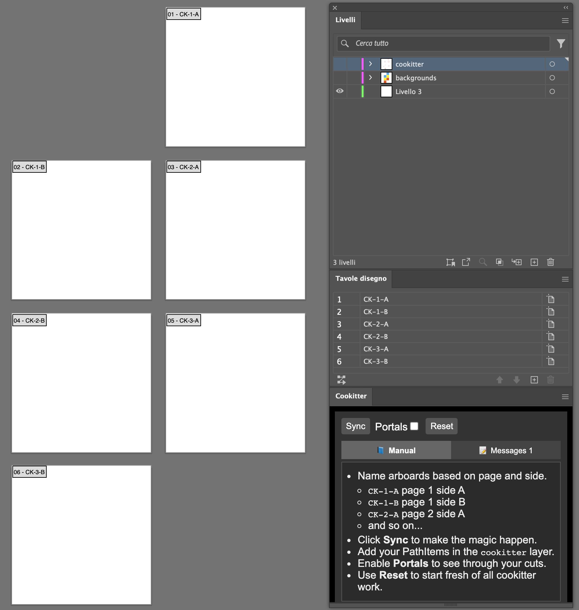
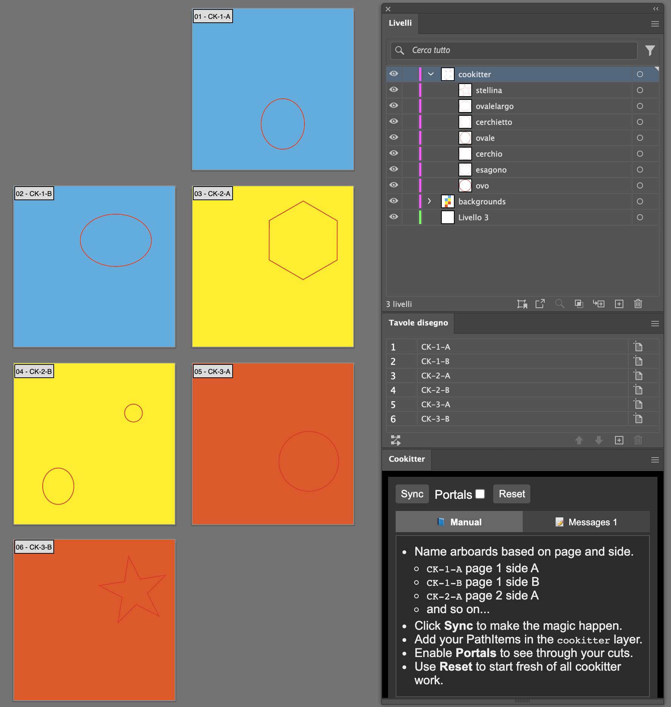
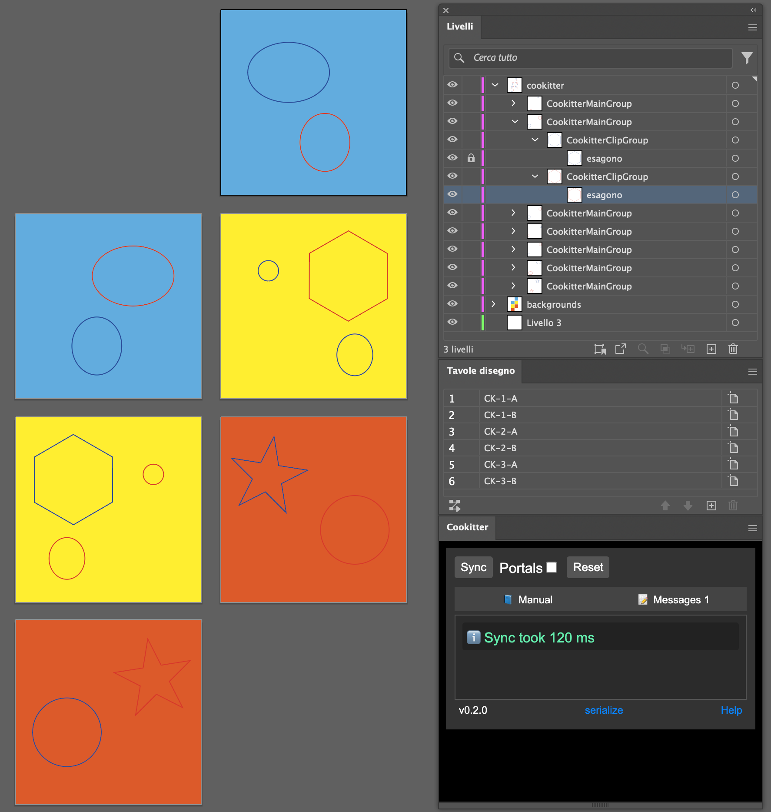
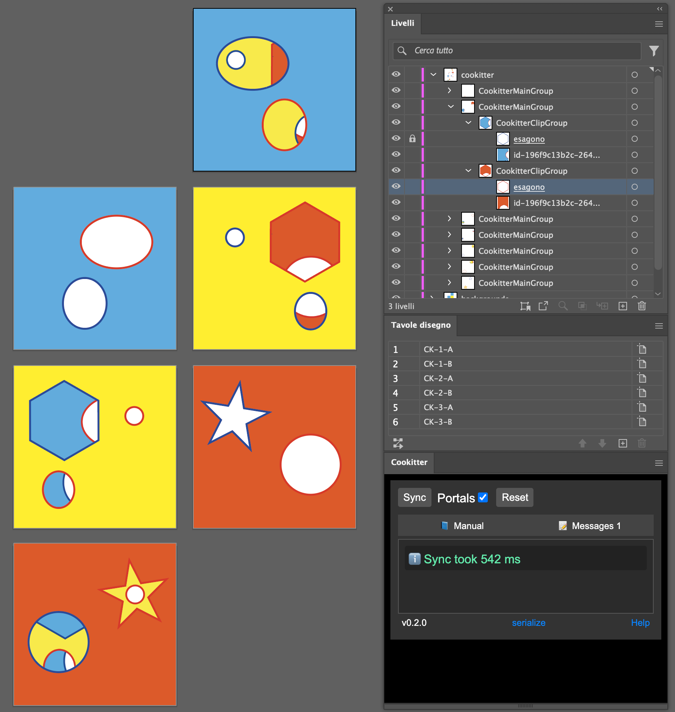

# Manual

## Prerequisite

Create a layer called `cookitter` to hold your elements, or just run <b>Sync</b> for the first time!.

## Pages Setup

Name the __artboards__ of your book accordingly to this format: `CK-<page_number>-<side_letter>`.

   For example the first side of the first page should be called `CK-1-A` while the second side will be `CK-1-B`.

  - <code>CK-1-A</code> page 1 side A
  - <code>CK-1-B</code> page 1 side B
  - <code>CK-2-A</code> page 2 side A
  - and so on...

In this example we have a small book with only 3 pages and so 6 sides.

</a>

## Draw your holes

Draw your shapes in the `cookitter` layer.

In this example we draw seven shapes, and gave each page a different color.
The backgrounds are in a different layer, only the holes you want to cut should be in the `cookitter` layer.

</a>

## Cut the hole

Run <b>Sync</b> to make the magic happen. The red shapes made by hand are mirrored on the other side.

You can distinguish your shapes from the one you drew by the distinct border color, yours are red and the Cookitter one are blue.

</a>

## Look through

Enable <b>Portals</b> and <b>Sync</b> to see through your cuts.

</a>